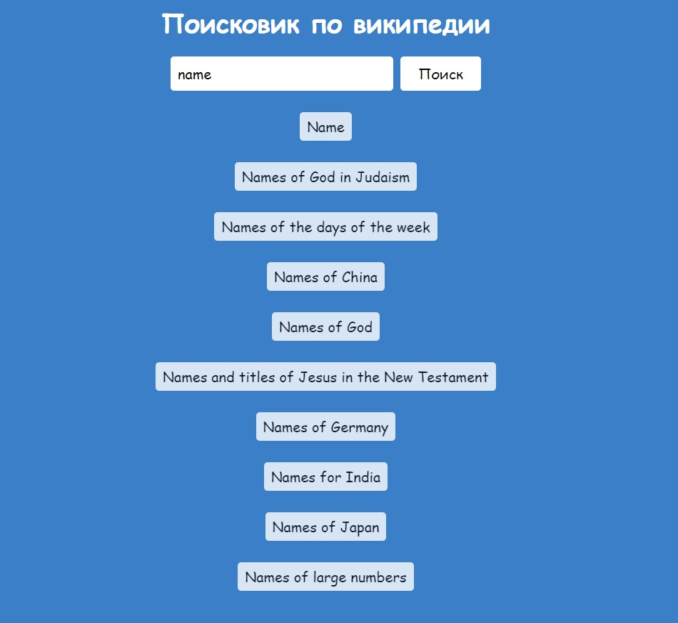

# Сайт "Поисковик по википедии"

## Инструкция для запуска

Скачивание всех зависимостей с помощью команды в терминале:

```bash
yarn
```

Запуск с помощью команды в терминале:

```bash
npm start
```

Сборка продакшн версии с помощью команды в терминале:

```bash
npm run build
```

## Превью сайта



## Описание проекта

В проекте реализован поиск по википедии с возможностью перехода на страницу результата поиска. Взаимодействие происходит с api "wikipedia.org".

## Технологии, использованные в проекте

* styled-components
* Typescript
* React
* Mobx
* mobx-react-lite
* Axios

## Ссылка на дэплой проекта

[Vercel](https://greenatom-test-one-8v1y.vercel.app)
