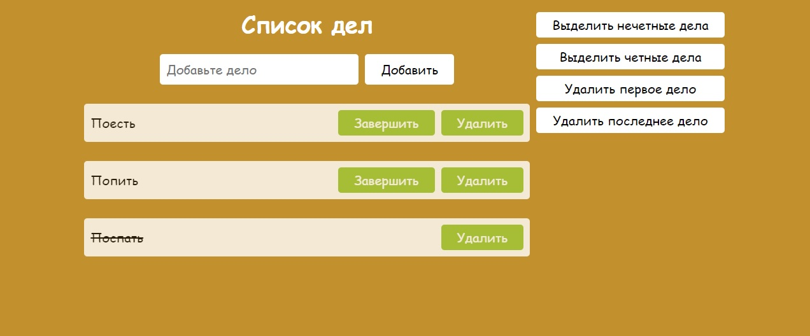

# Сайт "Список дел"

## Инструкция для запуска

Скачивание всех зависимостей с помощью команды в терминале:

```bash
yarn
```

Запуск с помощью команды в терминале:

```bash
npm start
```

Сборка продакшн версии с помощью команды в терминале:

```bash
npm run build
```

## Превью сайта



## Описание проекта

В проекте реализовано добавление, удаление дел. Также перевод в статус "Завершенные". Выделение четных и нечетных дел в списке, удаление первого и последнего дела.

## Технологии, использованные в проекте

* styled-components
* Typescript
* React
* Mobx
* mobx-react-lite
* nanoid

## Ссылка на дэплой проекта

[Vercel](https://mvttsun.github.io/mesto-react/)
